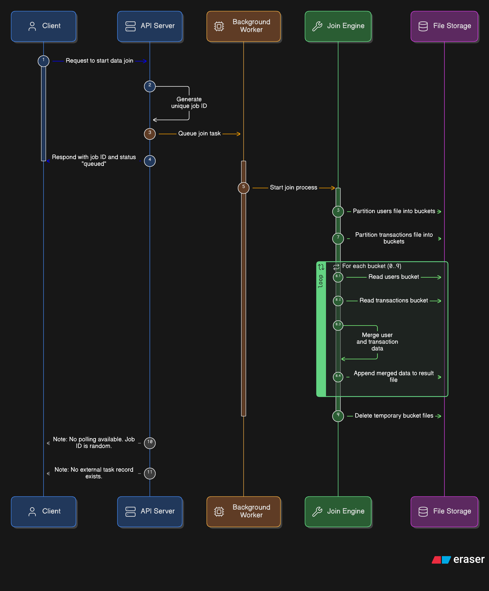
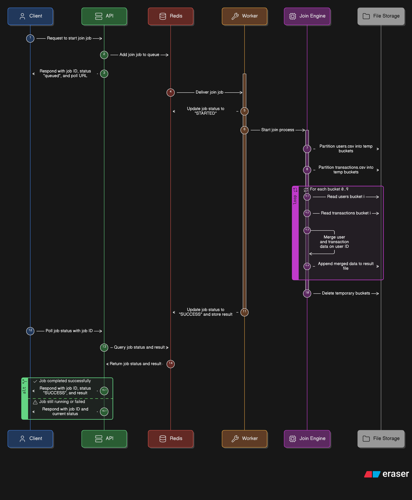

# Nexus Fusion

A FastAPI project that performs a large Files processing using two execution modes:

- `FastAPI BackgroundTasks` for in-process background execution

- `Celery + Redis` for decoupled, queued task execution with status polling

## Project structure

- `main.py` — FastAPI application exposing the join API endpoints
- `tasks.py` — Celery app and task definition
- `join_engine.py` — out-of-core join logic that partitions large CSV files and merges matching buckets
- `generate_data.py` — helper script to generate sample `users.csv` and `transactions.csv`
- `data/` — CSV inputs and generated output
- `requirements.txt` — Python dependencies


## How it works

`join_engine.py`:

1. Splits `data/users.csv` into bucket files under `data/temp_buckets`
2. Splits `data/transactions.csv` into bucket files under `data/temp_buckets`
3. Loads matching bucket pairs and performs an inner join on `user_id`
4. Writes the merged output to `data/result.csv`
5. Deletes temporary bucket files after completion

## Endpoints

- `POST /trigger-join/background`
  - Runs the join inside the FastAPI process using `BackgroundTasks`
  - Returns a generated `job_id` but does not support polling

- `POST /trigger-join/celery`
  - Enqueues a Celery task that runs `run_join()`
  - Returns a Celery task ID and poll URL

- `GET /job-status/{job_id}`
  - Polls Celery task state: `PENDING`, `STARTED`, `SUCCESS`, or `FAILURE`

## Workflow Diagrams

**Approach 1 — FastAPI BackgroundTasks**



**Approach 2 — Celery + Redis**



## Generate sample data

run this to get input data (one time process only):

```
python generate_data.py
```

This creates:

- `data/users.csv`
- `data/transactions.csv`

## Setup

1. Create and activate a virtual environment:

```
python -m venv venv
venv\Scripts\activate.bat
```

2. Install dependencies:

```
python -m pip install -r requirements.txt
```

## Run with Redis + Celery

1. Start Redis:

```
docker run -d --name redis -p 6379:6379 redis:7
```

This launches a local Redis container and exposes it on port `6379` for Celery to use.

2. Start the Celery worker (keep running, else message will just sit in queue resulting pending status indefinitely):

```
celery -A tasks worker --loglevel=info -P solo
```

3. Start the FastAPI app:

```
uvicorn main:app --reload --host 0.0.0.0 --port 8000
```

4. Use the interactive Swagger UI at `http://127.0.0.1:8000/docs`.

## Run via server endpoints

With the application running, the following HTTP endpoints are available:

- `POST /trigger-join/background`
- `POST /trigger-join/celery`
- `GET /job-status/{job_id}`

Example using `curl`:

```
curl -X POST http://127.0.0.1:8000/trigger-join/celery
```

```
curl http://127.0.0.1:8000/job-status/<task_id>
```

Or use browser-based Swagger UI at `http://127.0.0.1:8000/docs`.


